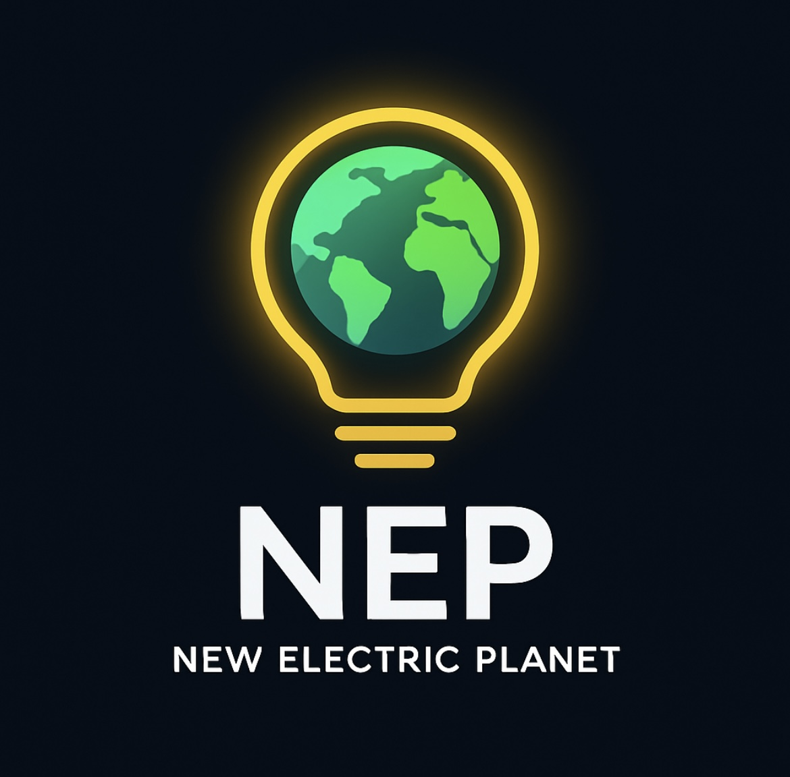

<!DOCTYPE html>
<html lang="ru">
<head>
  <meta charset="UTF-8">
  <title>NEP - New Electric Planet</title>
  
</head>
<body>
  <nav>
    <a href="#">Каталог</a>
    <a href="#">О компании</a>
    <a href="#">Контакты</a>
  </nav>

  

    
  

  <h1>NEP</h1>
  
NEW ELECTRIC PLANET

  
ЭНЕРГИЯ БУДУЩЕГО В ВАШИХ РУКАХ

  <a href="#" class="btn">ПЕРЕЙТИ В КАТАЛОГ</a>
</body>
</html>
